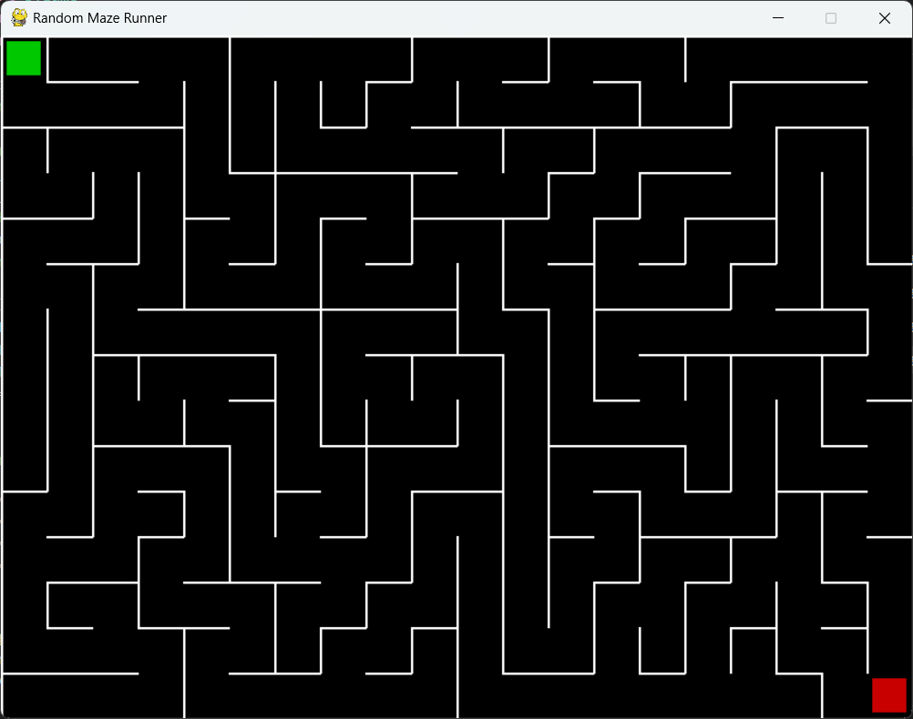

# 🌀 Simple Random Maze Runner

A simple maze game built with **Python** and **Pygame**, where the player navigates through a randomly generated maze to reach the exit.  
Each play generates a new maze, making every run unique!

---

## 🎮 Features
- Randomly generated maze every game
- Smooth box movement (Arrow keys or WASD)
- Start (blue) and End (red) points
- Win screen with **time taken**
- Restart shortcut: **Ctrl + R**
- Standalone **Windows .exe** build (no Python needed)
- MIT Licensed (free to use & modify)

---

## 🕹️ Controls
- **Move**: Arrow Keys ⬆️⬇️⬅️➡️ or **WASD**
- **Restart**: `Ctrl + R`
- **Quit**: Close window (or `Alt+F4`)

---

## 📷 Screenshot
 


---

## ▶️ Run the Game

### Option 1: Run the `.exe` (Windows)

1. Download the pre-built `rmr.exe` from the repo.
2. Double-click it to play — no Python or Pygame required!

### Option 2: Run from Python (Cross-platform)

1. Install [Python 3](https://www.python.org/downloads/)
2. Install Pygame:

   ```bash
   pip install pygame
   ```
3. Run the script:

   ```bash
   python rmr.py
   ```

---

## ⚙️ Build Instructions

### Windows (.exe)

```bash
pip install pyinstaller
pyinstaller --onefile --windowed rmr.py
```

Output: `dist/rmr.exe`

### Linux (binary)

```bash
pip install pyinstaller
pyinstaller --onefile rmr.py
```

Output: `dist/rmr`
(make it executable with `chmod +x dist/rmr`)

---

## 📜 License

This project is licensed under the [MIT License](LICENSE).
You are free to use, modify, and distribute this game.

---
<div align="center">
  <p>Made with ❤️ by <a href="https://github.com/0PKunal">0PKunal</a></p>
  <p>If this project helped you, please give it a ⭐️</p>
</div>